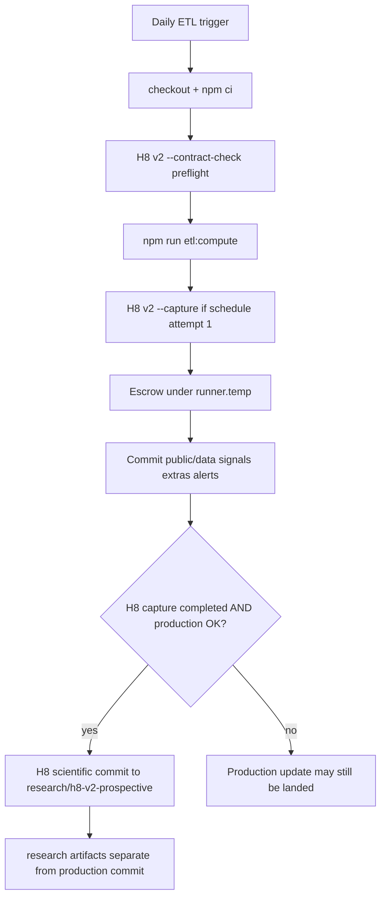
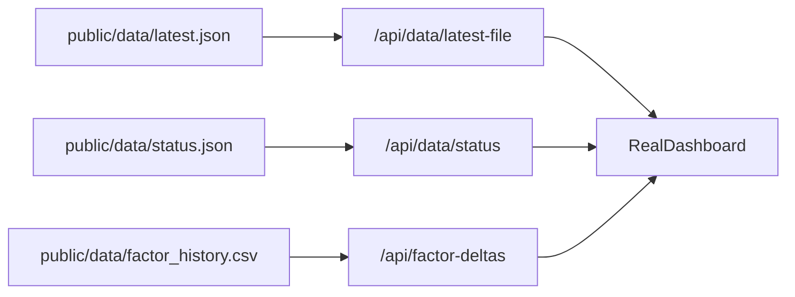
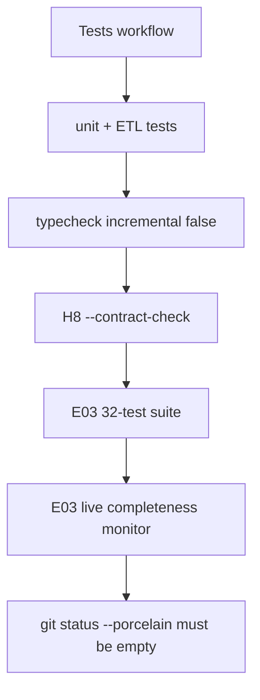

# GhostGauge Architecture & Dependency Map

| Field | Value |
| --- | --- |
| Task | E07 |
| Status | Documentation / read-only analysis only |
| Audited repository SHA | `3fd6e50be001c6006873da831e6f830156419ef3` |
| Audit date | 2026-09-11 |
| Scope | One new file. No architecture change. |

This map is **descriptive**. It is **not** an H8 protocol amendment, capture-contract amendment, or scoring-spec change.

If this document conflicts with frozen H8 protocol/contract artifacts or executable code, **the frozen artifacts / executable code control**.

Evidence is taken from the current repository (imports, calls, filesystem reads/writes, package scripts, GitHub workflow commands, API-route implementations, artifact paths, H8 contract constants, and the R14 Tests workflow). Relationships that cannot be proven are marked **UNRESOLVED** or **INDIRECT / NEEDS REVIEW**.

---

## Dependency types

| Type | Meaning |
| --- | --- |
| DIRECT CODE DEPENDENCY | Import, function call, or module relationship in source |
| ARTIFACT DEPENDENCY | A producer writes a file that another path reads |
| WORKFLOW DEPENDENCY | GitHub Actions orchestration, order, concurrency, or command |
| BUILD / DEPLOYMENT DEPENDENCY | Package, Node runtime, Next.js build, or Vercel deploy relationship |
| RESEARCH-CAPTURE DEPENDENCY | H8 v2 prospective scientific capture / provenance path |
| ADMIN / ASSURANCE DEPENDENCY | E03 / R14 validation only; not capture and not outcome analysis |
| LEGACY / DIAGNOSTIC DEPENDENCY | Present in the repo but not the authoritative current production surface |

### Review classifications

| Classification | Meaning |
| --- | --- |
| FROZEN — DO NOT MODIFY DURING LIVE H8 | Member of the 13-path scientific fingerprint |
| STAGE-A FROZEN — CAPTURE GOVERNANCE | Member of the four Stage-A capture identities |
| H8 INDIRECT RISK — DEPENDENCY REVIEW REQUIRED | Can affect scientific runtime or capture without changing a fingerprint object |
| PRODUCTION RUNTIME — SCIENTIFIC REVIEW REQUIRED | Participates in official ETL scoring or production artifact writing |
| PUBLIC / DISPLAY — GENERALLY SAFE AFTER DEPENDENCY CHECK | Primarily reads committed artifacts or renders UI; still check imports/API edges |
| ADMIN / ASSURANCE — READ-ONLY | R14/E03 contract/integrity checks |
| GENERATED ARTIFACT — DO NOT HAND-EDIT | Written by automation; do not edit in a PR |
| LEGACY / QUARANTINED | Not the current public contract |
| RESEARCH / DEFERRED OUTCOME WORK | Outcome-analysis / reconstruction suites; not live-H8 CI |
| UNRESOLVED | Relationship exists or might exist, but current code does not prove the claim |

Do not treat any label as a guarantee that a change is scientifically harmless.

---

## Execution lane A — Daily production ETL

**Entry:** `.github/workflows/daily-etl.yml`  
**Package command:** `npm run etl:compute` → `node scripts/etl/compute.mjs`

### Workflow facts (verified)

- Triggers: `schedule` cron `0 11 * * *` and `workflow_dispatch`
- Permissions: `contents: write`
- Concurrency group: `etl`
- `cancel-in-progress: false`
- Checkout: `actions/checkout@v5` with `fetch-depth: 0` and `persist-credentials: true`
- Node: `20.18.0` via `actions/setup-node@v5`
- Install: `npm ci --ignore-scripts --no-audit --fund=false`
- Production secrets used by the compute step: `FRED_API_KEY`, `ALPHA_VANTAGE_API_KEY`
- Production commit stages only: `public/data`, `public/signals`, `public/extras`, `public/alerts`
- The production commit step **fails closed** if any `research/` path is staged
- Commit message: `chore(etl): update artifacts [skip ci]`

### Ordered flow

```text
schedule / workflow_dispatch
  → checkout / npm ci
  → Initialize H8 v2 capture gate (env flags default false)
  → H8 v2 identity preflight
       only if github.event_name == schedule AND github.run_attempt == 1
       command: node scripts/research/capture-h8-v2-prospective.mjs --contract-check
       continue-on-error: true; step always exits 0
  → Record H8_V2_ETL_STARTED_UTC
  → npm run etl:compute  (scripts/etl/compute.mjs)
  → optional status.json social_interest print
  → H8 v2 prospective capture
       only if schedule AND run_attempt == 1 AND H8_V2_CAPTURE_ALLOWED == true
       command: node scripts/research/capture-h8-v2-prospective.mjs --capture
       continue-on-error: true; artifacts created then escrowed under runner.temp
  → Escrow H8 v2 artifacts (runEscrowPhase)
  → Commit/push production artifacts (public/* only)
  → H8 v2 scientific commit (runH8V2ScientificPhase)
       only if capture completed AND production push succeeded
```

Fail-closed separation (workflow text): production ETL continues if H8 preflight/capture/scientific commit fails; a landed production update is not rolled back by a later H8 failure.



---

## Official production scoring path

Authoritative G-Score production is **Daily ETL `scripts/etl/compute.mjs`**, not the Next.js app.

### Direct code chain

1. `config/dashboard-config.json` — SSOT weights, bands, enablement, model metadata  
   Evidence: `lib/config-loader.mjs` reads this file; `compute.mjs` and `factors.mjs` call `getDashboardConfig()`.
2. `lib/config-loader.mjs` — ETL/Node loader used by compute and factors.
3. `scripts/etl/compute.mjs` — orchestrates price snapshot, `computeAllFactors()`, official adjustment gating, band match, and artifact writes.
4. `scripts/etl/factors.mjs` — `computeAllFactors()` runs the factor jobs and weighted composite from enabled SSOT factors.
5. `scripts/etl/factors/**` — including `trendValuation.mjs` (also imported through the factors tree).
6. `scripts/etl/lib/**` — snapshot price, SSOT subweights, official adjustments gate, risk band, signal v2, ETF zero-cross, gscore history CSV, freshness helpers.
7. Other frozen scientific files used by that runtime:
   - `scripts/etl/stalenessUtils.mjs`
   - `scripts/etl/marketCalendar.mjs`
   - `scripts/etl/adjustments.mjs` (dynamic import from `compute.mjs`)
   - `scripts/etl/coinGeckoCache.mjs` (imported by `factors.mjs`)
   - `scripts/etl/priceHistory.mjs` (`managePriceHistory()` from `compute.mjs`)
   - `scripts/etl/fetch-helper.mjs` (imported by `factors.mjs` and `compute.mjs`)

### Seven enabled production factors

`config/dashboard-config.json` currently enables:

- `trend_valuation`
- `stablecoins`
- `etf_flows`
- `net_liquidity`
- `term_leverage`
- `macro_overlay`
- `social_interest`

`onchain` is present in config and in `computeAllFactors()` jobs, but `enabled: false`. H8 capture-core `REQUIRED_FACTOR_KEYS` lists the seven enabled keys above.

Cycle/spike adjustments exist in `scripts/etl/adjustments.mjs` and are passed through `gateOfficialAdjustments()`; config currently has those adjustment flags disabled. This map does not evaluate their empirical effect.

Composite write: `compute.mjs` writes `public/data/latest.json` with `composite_score` / `composite_raw` / `band` / `factors` after gating. This document does not reproduce scores.

### H8-indirect writers invoked by frozen compute

These are **not** members of the 13-path fingerprint, but `compute.mjs` calls them:

| Path | How invoked | Effect |
| --- | --- | --- |
| `scripts/etl/factor-history-tracking.mjs` | dynamic import `syncFactorHistoryFromRun` | writes `public/data/factor_history.csv` |
| `scripts/etl/generate-indicator-alerts.mjs` | `exec` child process | writes legacy `public/data/*_alerts.json` family |
| `scripts/etl/generate-factor-change-alerts.mjs` | `exec` child process | writes `public/data/factor_change_alerts.json` |
| `scripts/etl/monitor-data-freshness.mjs` | `exec` child process | writes freshness monitoring artifacts |

Classification: **H8 INDIRECT RISK — DEPENDENCY REVIEW REQUIRED** for those child scripts/modules, because changing them does not change a frozen Git object identity but can change production-adjacent files Daily ETL commits.

---

## Public / display read path

Default home page: `app/page.tsx` → `CanaryPage` → `ViewSwitch` → `RealDashboard` unless `?view=simple` or `NEXT_PUBLIC_USE_SIMPLE_DASHBOARD=true`.

### Verified RealDashboard fetches

From `app/components/RealDashboard.tsx` `load()`:

- `GET /api/data/latest-file`
- `GET /api/data/status`
- non-blocking `GET /api/factor-deltas`
- a refresh button may `POST /api/smart-refresh-simple` (spot/gold display helper; not `scripts/etl/compute.mjs`)

`SimpleDashboard` fetches `/api/data/latest-file` only.

### Artifact → API → UI

| Artifact | API | UI |
| --- | --- | --- |
| `public/data/latest.json` | `app/api/data/latest-file/route.ts` via `readLatestArtifact()` in `lib/latestArtifact.ts` | RealDashboard / SimpleDashboard |
| `public/data/latest.json` | `app/api/data/latest/route.ts` — documented in-file as a **legacy alias** of latest-file | not used by RealDashboard initial load |
| `public/data/status.json` | `app/api/data/status/route.ts` reads the JSON file | RealDashboard |
| `public/data/factor_history.csv` | `app/api/factor-deltas/route.ts` | RealDashboard deltas |

`lib/latestArtifact.ts` reads `public/data/latest.json`. If a stored `composite_score` falls outside the stored band range, it may replace `band` using `getBandForScore` from `lib/riskConfig.server`. RealDashboard performs a similar client-side rematch via `lib/riskConfig.client`. These paths **do not recompute the official G-Score**; they can change displayed band metadata. Classification: **PUBLIC / DISPLAY** with a dependency check on SSOT band tables.



Normal dashboard initial loading **does not** call `/api/refresh`.

---

## Parallel path — `/api/refresh`

File: `app/api/refresh/route.ts`

### Current HTTP contract (verified)

- `POST`: returns **405** `{ error: 'Recompute disabled; ETL only.' }`
- `GET`: rate-limited; returns `{ mode: 'artifacts', message: 'Use ETL artifacts directly via /data/latest.json' }`
- Internal `buildLatest()` still contains a parallel real-time implementation using:
  - `lib/factors/trendValuation`, `social`, `etfFlows`, `netLiquidity`, `stablecoins`, `termLeverage`, `onchain`, `macroOverlay`
  - `lib/data/btc`
  - `lib/math/powerLaw`, `lib/math/normalize`
  - `lib/adjust/fastSpike`
  - `lib/riskConfig.server`
- Repository-wide grep shows **`buildLatest` is defined and never called**.

Classification: **PARALLEL / NON-CANONICAL REAL-TIME COMPUTATION PATH** — currently HTTP-gated closed / uninvoked.

Do **not** treat `lib/factors/**` as scientifically equivalent to `scripts/etl/factors.mjs`. Equivalence is **UNRESOLVED** and is not proven by current code.

Related diagnostic consumers:

- `app/data-sources/page.tsx` fetches `GET /api/refresh` (receives the stub, not a live recompute)
- `scripts/etl/update-history.ts` (`npm run etl`) calls `/api/refresh?mode=snapshot` — this is **not** Daily ETL (`etl:compute`)

---

## Execution lane B — H8 v2 prospective capture

H8 is orchestrated **inside Daily ETL** but research artifacts are committed separately from production.

### Capture CLI

`scripts/research/capture-h8-v2-prospective.mjs` modes (`parseArgs`):

- `--contract-check` (read-only; asserts `filesWritten === 0` and `assertNoPerformanceOrNetwork()`)
- `--capture` (scheduled first attempt only)
- `--validate-start-candidate`

Real capture requires `github.event_name == schedule` **and** `github.run_attempt == 1` (workflow `if:` plus capture event gate). `workflow_dispatch` does not run preflight/capture steps.

Capture reads production artifacts as inputs (`LATEST_PATH` = `public/data/latest.json`, `BTC_SOURCE_PATH` = `public/data/btc_price_history.csv` in capture-core). It does not replace Daily ETL scoring.

Created research files are escrowed under `${{ runner.temp }}/h8-v2-escrow` then landed by `runH8V2ScientificPhase()` onto `research/h8-v2-prospective/**` with `[skip ci]` research commit messages.

Present control/study artifacts (paths only; this map does not inspect observation/close payloads for scores or prices):

- `research/h8-v2-prospective/H8_V2_START.json`
- `research/h8-v2-prospective/H8_V2_CAPTURE_SOURCE_SHA.txt`
- `research/h8-v2-prospective/observations/*.json`
- `research/h8-v2-prospective/btc-closes/*.json`
- `research/h8-v2-prospective/rehearsals/*.json`

This lane is **not** weekly backtesting and **not** H8 outcome analysis.

---

## H8 frozen scientific surface (13 identities)

Changes to this surface during live H8 invoke the frozen protocol governance boundary and are **not ordinary maintenance**.

| Path | Frozen object SHA |
| --- | --- |
| `config/dashboard-config.json` | `b5c606b8f14f9e2a2c29061f2ae1c4d4337c8a49` |
| `lib/config-loader.mjs` | `8f439254ca813050703a7c17bcd658474c19e2b2` |
| `scripts/etl/compute.mjs` | `6f16c1f24bc097d6079fffc0ea7b5889c91ea0d4` |
| `scripts/etl/factors.mjs` | `e9fd06df79967f0041a901e2dd971b771e669b03` |
| `scripts/etl/factors/` | `163b086f72ec43117e8bfcbbe5fd31732dae715d` |
| `scripts/etl/factors/trendValuation.mjs` | `3abf6f0611f86f58aca06c736d9baf41c7eb4ae9` |
| `scripts/etl/lib/` | `64c73c01db27f1e6dbcd12d45d08c2f12bc47b12` |
| `scripts/etl/stalenessUtils.mjs` | `1c213b9b8eb659c9cda22d0834694ae3239eb768` |
| `scripts/etl/marketCalendar.mjs` | `77c5669f77bef11cbc43fb85f82bb4a42bfc2136` |
| `scripts/etl/adjustments.mjs` | `36a6d3c5220ac7ac9e7493bc49176840ed5fe9d7` |
| `scripts/etl/coinGeckoCache.mjs` | `fbfc5e35b3bd4af60eb00e780892b62f94e8bbff` |
| `scripts/etl/priceHistory.mjs` | `515b02acdd0cf4a72e62889dafb83cec6e8acd95` |
| `scripts/etl/fetch-helper.mjs` | `da8ca2b441088f2e13364249e7ecbbed40dc22a4` |

Source of the table: `SCIENTIFIC_FINGERPRINT` / `SCIENTIFIC_FILE_BLOBS` / `SCIENTIFIC_TREE_SHAS` in `scripts/research/lib/h8-v2-prospective-capture-core.mjs`, reconfirmed against Git objects at the audited SHA.

Deferred scientific correction surfaces R01 (RRP units), R02 (ETF BTC/FBTC identity), and R03 (Social missingness) live on this frozen factor/config surface. This map does not analyze or repair them.

---

## H8 Stage-A / capture surface (4 identities)

This surface governs **capture mechanics and provenance**, not model weighting alone.

| Path | Frozen object SHA |
| --- | --- |
| `.github/workflows/daily-etl.yml` | `d072a2f0334c71d28d5eb68335a5a3b905a7f793` |
| `scripts/research/capture-h8-v2-prospective.mjs` | `1909771cd574e2cb6216825654234a2dc142973a` |
| `scripts/research/lib/h8-v2-prospective-capture-core.mjs` | `798e933f4b5c31e850192353e6bc6d2c269a25a4` |
| `scripts/research/lib/h8-v2-prospective-capture-io.mjs` | `c9c3b69e8b41b2614a456a51c067dfb7039d5c8c` |

Also listed as `STAGE_A_RUNTIME_PATHS` in capture-core.

---

## Indirect dependencies not represented by the 13-path fingerprint

Daily ETL runs `npm ci` **before** scientific execution. The 13 Git object identities do not include lockfile or runner identity. Therefore the following can plausibly change runtime scientific behavior without altering a frozen scientific SHA:

| Surface | Why it is H8-indirect |
| --- | --- |
| `package.json` / `package-lock.json` | `npm ci` resolves the compute process dependencies |
| Node runtime version | Daily ETL pins `20.18.0`; `package.json` `engines` is `>=20.18 <21` |
| GitHub Actions runner / `actions/checkout` / `actions/setup-node` | Daily ETL currently uses action major v5; Tests still uses v4 |
| Workflow env / secrets / provider availability | Compute step injects FRED and Alpha Vantage secrets; missing providers change factor fetch/fallback behavior |
| `scripts/etl/factor-history-tracking.mjs` and child `exec` scripts | Called by frozen `compute.mjs` but not fingerprint members |
| `lib/config-loader.ts` / `lib/riskConfig.server.ts` / `lib/riskConfig.client.ts` | Next.js loaders of the same SSOT JSON; not the ETL `.mjs` loader |
| Nested tracked copies under `scripts/etl/public/**` | Not in the Daily ETL `git add` list; role **UNRESOLVED** (leftover copies; not proven as a writer destination) |

Classification: **H8 INDIRECT RISK — DEPENDENCY REVIEW REQUIRED**.

Do not assert that dependency or runner changes are scientifically harmless.

---

## Execution lane C — R14 CI / E03

**Entry:** `.github/workflows/tests.yml`  
Triggers: `push` and `pull_request` to `main` / `develop` only (no `schedule`, no `workflow_dispatch`).  
Permissions: `contents: read`.  
Checkout: `actions/checkout@v4`, `fetch-depth: 0`, `persist-credentials: false`.  
Node: `20.18.0`.

### Current commands (order)

1. `npm ci --ignore-scripts --no-audit --fund=false`
2. `npm run test` (vitest unit tests under `lib/__tests__`)
3. `npm run test:etl`
4. `npm run typecheck -- --incremental false`
5. `node scripts/research/capture-h8-v2-prospective.mjs --contract-check`
6. `node --test scripts/admin/__tests__/h8-completeness-monitor.test.mjs`
7. `node scripts/admin/h8-completeness-monitor.mjs` (default yesterday-UTC cutoff)
8. worktree cleanliness check with `if: ${{ always() }}`



R14 does **not** capture H8 observations. R14 does **not** run outcome-analysis suites. E03 ordinary `ATTENTION` is exit 0 (non-failing). E03 `INTEGRITY_ALERT` is exit 2 and fails CI. This is **ADMIN / ASSURANCE — READ-ONLY**, not scientific analysis.

E03 reads `research/h8-v2-prospective/H8_V2_START.json`, `observations/`, and `btc-closes/` plus HEAD fingerprint metadata. It does not write artifacts.

---

## Stale H8 implementation test suite

`scripts/research/__tests__/h8-v2-prospective-capture.test.mjs` contains lifecycle tests including pre-start real-repository assumptions that are stale after Stage-B activation (sidecars/study dirs now exist).

It is **not** invoked by R14 CI (`tests.yml` has no reference to that file and no wildcard over `scripts/research/__tests__`).

Classification: **DEFERRED TEST DEBT / NOT CURRENT LIVE-H8 CI GATE** (`RESEARCH / DEFERRED OUTCOME WORK` adjacent; do not treat 17 historical failures as proof that frozen production capture is currently invalid).

Do not delete or repair it inside E07.

---

## Execution lane D — weekly backtesting

**Entry:** `.github/workflows/weekly-backtesting.yml`

- Triggers: `schedule` cron `30 11 * * 0` (Sunday 11:30 UTC) and `workflow_dispatch`
- Concurrency group: `weekly-backtesting`
- `cancel-in-progress: false`
- Permissions: `contents: write`
- Node: `"20"` (not the Daily ETL `20.18.0` pin)
- Commands: `npm run etl:backtesting` → `scripts/etl/weekly-backtesting.mjs`; `npm run etl:strategy-comparison` → `scripts/etl/dca-vs-risk-strategy-comparison.mjs`
- Commit adds only:
  - `public/data/weekly_backtesting_report.json`
  - `public/data/dca_vs_risk_comparison.json`
- Reads `public/data/history.csv` as input (verified in both scripts)

This is a **separate scheduled writer** from Daily ETL. It is **not** H8 v2 prospective outcome analysis.

---

## Alerts path (post R13-C)

### Current public contract

| Piece | Evidence |
| --- | --- |
| Artifact | `public/alerts/latest.json` written by `scripts/etl/compute.mjs` (`etf_zero_cross` + `band_change` current-run events) |
| API | `app/api/alerts/route.ts` reads **only** `public/alerts/latest.json`; fail-closed 503; `legacy_sources_excluded: true`; `history_complete: false` |
| UI | `app/alerts/page.tsx` fetches `/api/alerts`; `app/alerts/types/page.tsx` documents the two current ETL event types |

`app/components/AlertBell.tsx` also fetches `/api/alerts`, but `RealDashboard.tsx` currently **imports** it and does **not** render `<AlertBell />`. Classification: present diagnostic component, not mounted on the live dashboard.

`public/alerts/log.csv` is appended by `compute.mjs` as an idempotence/log file. It is **not** the public Alerts API source and must not be promoted to complete history.

### Legacy / quarantined alert families

Still generated or present as files, but **not** the current public Alerts contract:

- `public/data/factor_change_alerts.json`
- `public/data/factor_staleness_alerts.json`
- `public/data/etf_zero_cross_alerts.json`
- `public/data/risk_band_change_alerts.json`
- `public/data/sma50w_warning_alerts.json`
- `public/data/alert_management_summary.json`
- generators such as `scripts/etl/generate-indicator-alerts.mjs` / `generate-factor-change-alerts.mjs`

Classification: **LEGACY / QUARANTINED FROM CURRENT PUBLIC CONTRACT**. E07 does not repair them.

---

## Artifact registry

| Artifact | Writer | Reader(s) | Cadence / workflow | Role | Authoritative? | H8-sensitive? | Notes |
| --- | --- | --- | --- | --- | --- | --- | --- |
| `public/data/latest.json` | `scripts/etl/compute.mjs` | `/api/data/latest-file`, `/api/data/latest`, H8 capture (`LATEST_PATH`), optional unused `buildLatest` ETL-read branch | Daily ETL | Official current G-Score snapshot | Yes for production display/score | Yes as capture input; path is **not** in the 13-path fingerprint | GENERATED ARTIFACT |
| `public/data/status.json` | `scripts/etl/compute.mjs` | `/api/data/status`, RealDashboard | Daily ETL | Factor/status metadata | Yes for dashboard status | Indirect (production commit) | GENERATED ARTIFACT |
| `public/data/history.csv` | `compute.mjs` via `upsertGScoreHistoryCsv` | weekly backtesting scripts; band-change compare in compute | Daily ETL | Historical composite rows | Production history writer | Indirect | GENERATED ARTIFACT |
| `public/data/factor_history.csv` | `factor-history-tracking.mjs` from compute | `/api/factor-deltas`, factor-history APIs | Daily ETL | Per-factor history | Production history | Writer is H8-indirect | GENERATED ARTIFACT |
| `public/data/btc_price_history.csv` | `priceHistory.mjs` `managePriceHistory()` | H8 capture (`BTC_SOURCE_PATH`); research outcome scripts (deferred) | Daily ETL | Completed UTC close series | Canonical price-history CSV | Yes as capture input; file is frozen **writer** (`priceHistory.mjs`) | Do not inspect values here |
| `public/alerts/latest.json` | `compute.mjs` | `/api/alerts`, alerts pages | Daily ETL | Current ETL events only | Yes for public Alerts | Indirect | Not a complete ledger |
| `public/alerts/log.csv` | `compute.mjs` | compute idempotence | Daily ETL | Append-only log | No public API | Indirect | Do not promote to history |
| `public/signals/v2/*` | `writeFactorSignalV2` in compute/lib | ETF zero-cross detector | Daily ETL | Structured factor series | Production signals v2 | Writer lives in frozen `scripts/etl/lib/` | GENERATED ARTIFACT |
| `public/signals/*.csv` | compute may skip/append per flags | historically frozen | Daily ETL | Legacy signal CSVs | No | Indirect | LEGACY |
| `public/extras/gold_cross.json`, `public/extras/sats.json` | `compute.mjs` | extras pages (not mapped in depth) | Daily ETL | Display extras | Display | Indirect | GENERATED ARTIFACT |
| `public/data/cache/**` | factor fetch helpers | subsequent ETL runs | Daily ETL | Provider caches | Operational | Indirect | GENERATED ARTIFACT |
| `public/data/weekly_backtesting_report.json` | `weekly-backtesting.mjs` | none required by H8 | Weekly Backtesting | Monitoring sim | Separate from Daily ETL / H8 | No H8 capture | Not H8 outcome analysis |
| `public/data/dca_vs_risk_comparison.json` | `dca-vs-risk-strategy-comparison.mjs` | `/api/strategy-comparison` | Weekly Backtesting | Strategy comparison JSON | Separate scheduled writer | No H8 capture | RESEARCH / product reporting, not H8 |
| `research/h8-v2-prospective/H8_V2_START.json` | capture scientific phase (already landed) | E03; capture CLI | H8 scientific commit | Study start control | Yes for H8 study window | Yes | GENERATED / control artifact |
| `research/h8-v2-prospective/H8_V2_CAPTURE_SOURCE_SHA.txt` | Stage-B activation sidecar | capture identity | H8 | Capture-source identity | Yes for capture | Yes | Do not hand-edit |
| `research/h8-v2-prospective/observations/**` | H8 `--capture` + scientific commit | E03 | Daily ETL H8 lane | Prospective observations | H8 study | Yes | Path/provenance only in this map |
| `research/h8-v2-prospective/btc-closes/**` | H8 capture + scientific commit | E03 | Daily ETL H8 lane | Close completeness artifacts | H8 study | Yes | Path/provenance only |
| `research/h8-v2-prospective/rehearsals/**` | pre-start rehearsal landing | capture topology | historical | Rehearsal records | Control history | Yes | Present on audited tree |
| `public/data/*_alerts.json` families | child scripts from compute | not `/api/alerts` | Daily ETL side effects | Legacy alert stores | No | Indirect | LEGACY / QUARANTINED |
| `scripts/etl/public/**` | UNRESOLVED | UNRESOLVED | not Daily ETL `git add` | Nested tracked copies | No | Unlikely / UNRESOLVED | Do not treat as production SSOT |

---

## Change-impact matrix

| Path / surface | Official production score? | H8 scientific identity? | H8 capture mechanics? | Public UI only? | Writes committed artifacts? | Review classification |
| --- | --- | --- | --- | --- | --- | --- |
| `config/dashboard-config.json` | Yes | Yes (fingerprint member) | Indirect via capture of latest | No | No (config is source) | FROZEN — DO NOT MODIFY DURING LIVE H8 |
| `lib/config-loader.mjs` | Yes | Yes | Indirect | No | No | FROZEN |
| `scripts/etl/compute.mjs` / `factors.mjs` / `factors/` / `lib/` / listed scientific files | Yes | Yes | Capture consumes resulting artifacts | No | Yes via Daily ETL | FROZEN / PRODUCTION RUNTIME |
| `scripts/etl/**` outside the 13 paths (e.g. `factor-history-tracking.mjs`, alert generators, weekly scripts) | Maybe (child of compute or separate writer) | No | Usually no | No | Often yes | H8 INDIRECT RISK or PRODUCTION RUNTIME |
| `scripts/research/capture-h8-v2-prospective.mjs` | No | No | Yes | No | Research artifacts only via scientific phase | STAGE-A FROZEN |
| `scripts/research/lib/h8-v2-*` | No | Core encodes fingerprint constants | Yes | No | Escrow/commit helpers | STAGE-A FROZEN |
| `research/h8-v2-prospective/**` | No | No | Yes (study store) | No | Written by H8, not hand PRs | GENERATED ARTIFACT |
| `package.json` / `package-lock.json` | Plausible via `npm ci` | No | Plausible | No | No | H8 INDIRECT RISK — DEPENDENCY REVIEW REQUIRED |
| `.github/workflows/daily-etl.yml` | Orchestrates compute | No | Yes (order, gates, schedule) | No | Triggers writers | STAGE-A FROZEN |
| `.github/workflows/tests.yml` | No | No (contract-check / E03) | Assurance only | No | No | ADMIN / ASSURANCE |
| `.github/workflows/weekly-backtesting.yml` | No | No | No | Indirect via public JSON | Yes (two JSON files) | PRODUCTION RUNTIME for those artifacts, not H8 |
| `app/components/**` | No, except band rematch display | No | No | Usually yes after checking fetches | No | PUBLIC / DISPLAY — GENERALLY SAFE AFTER DEPENDENCY CHECK |
| `app/api/data/**` | No (read artifacts; latest-file may rematch band) | No | No | Display/API | No | PUBLIC / DISPLAY |
| `app/api/refresh/route.ts` | Not via current GET/POST; `buildLatest` unused | No | No | Diagnostic stub | No | PARALLEL / NON-CANONICAL; review before re-enabling |
| `app/api/alerts/route.ts` | No | No | No | Alerts UI | No | PUBLIC / DISPLAY of current ETL events |
| `public/data/**` | Changing files by hand would change displayed/captured inputs | No identity SHA | Capture reads latest + btc history | Display | Those files **are** the artifacts | GENERATED ARTIFACT — DO NOT HAND-EDIT |
| `public/alerts/**` | No | No | No | Alerts | Daily ETL writes | GENERATED ARTIFACT / current vs log |
| `docs/**` | No | No | No | Docs | No | PUBLIC / DISPLAY (this file included) |
| `lib/factors/**` | Only if `/api/refresh` `buildLatest` were invoked | No | No | Would be a parallel scorer | No | PARALLEL / NON-CANONICAL; UNRESOLVED vs ETL |
| `scripts/admin/**` | No | Detects frozen-path drift | No | No | No | ADMIN / ASSURANCE |

There is **no** blanket “all app changes are safe” rule: API routes can contain computation (`refresh`, and historically others).

---

## Non-obvious coupling

Verified from current code:

- Daily ETL performs **both** production update orchestration and H8 capture orchestration in one workflow, with fail-closed separation.
- H8 research artifacts are intentionally **not** part of the production `git add` (explicit `research/` staging refusal).
- `package.json` / lockfile / Node / action versions can affect scientific runtime even though they are outside the 13-path fingerprint, because Daily ETL runs `npm ci` then `etl:compute`.
- `app/api/refresh/route.ts` still contains a separate real-time computation implementation (`buildLatest` + `lib/factors/**`) that is **not** called by current GET/POST handlers.
- Weekly backtesting is an independent public-artifact writer with its own concurrency group and a Node 20 major-version request, rather than Daily ETL's exact 20.18.0 runtime request.
- Alerts has a current-output contract (`public/alerts/latest.json`) and legacy artifact/generator families under `public/data/*_alerts.json`.
- Public artifact commits (`[skip ci]`) can still trigger Vercel/build behavior because they are commits to `main`, even though the payload is data rather than application source. Exact Vercel skip rules for docs-only PRs are **UNRESOLVED** without deployment-config evidence (`vercel.json` is absent).
- `compute.mjs` shells out to non-fingerprint scripts; frozen identity of `compute.mjs` does not freeze those callees.
- Display-side band rematch (`latestArtifact` / RealDashboard / `riskConfig.*`) can change shown band without changing stored `composite_score`.
- Two config loaders exist: `lib/config-loader.mjs` (ETL, fingerprint member) and `lib/config-loader.ts` / `lib/riskConfig.server.ts` (Next). They both read `config/dashboard-config.json`.

---

## Unresolved relationships

- Scientific equivalence of `lib/factors/**` versus `scripts/etl/factors.mjs`: **UNRESOLVED** (do not claim equivalence).
- Whether unused `buildLatest` will be reconnected in a future PR: **UNRESOLVED**; currently uninvoked.
- Origin and runtime role of tracked `scripts/etl/public/**` nested copies: **UNRESOLVED**; not Daily ETL staging paths.
- Whether docs-only PRs skip Vercel: **UNRESOLVED** from repo config (no `vercel.json`); expect the platform default (usually still a preview build).
- Full consumer graph of every `public/data/cache/**` file: not exhaustively proven; cache writes are treated as ETL operational artifacts.

---

## Future PR review checklist

Before approving a GhostGauge change, answer:

1. Does this touch a frozen scientific path (the 13 identities)?
2. Does it touch Stage-A (Daily ETL workflow or H8 capture CLI/core/io)?
3. Can it affect scientific runtime **indirectly** (lockfile, Node, Actions, secrets, non-fingerprint callees of `compute.mjs`)?
4. Does it change an ETL-written artifact, or add another writer to `public/data` or `research/`?
5. Does it invoke or re-enable real-time computation separate from canonical ETL (`/api/refresh` `buildLatest`, `lib/factors/**`)?
6. Does it change a workflow trigger, concurrency group, step order, or `continue-on-error` / exit-code contract?
7. Does it expose H8 outcome information (scores, prices, returns, correlations, model ranking)?
8. Does it alter public semantics (Alerts, dashboard band labels, API contracts) without changing model math?
9. Is it actually documentation/UI-only, or does an import/API edge make it runtime-sensitive?
10. If Tests CI is involved: is the live gate still `--contract-check` plus E03, with **no** research-test wildcard and **no** outcome suites?

Do not use this checklist as an implementation recommendation beyond dependency classification.

---

## Related workflows not in the four execution lanes

`.github/workflows/bundle-size-tracking.yml` builds the Next app (`npm run build`) and may commit an automation-owned README badge (`Update bundle size badge`). Classification: **BUILD / DEPLOYMENT DEPENDENCY**. Not H8 capture. Not Daily ETL scoring.
